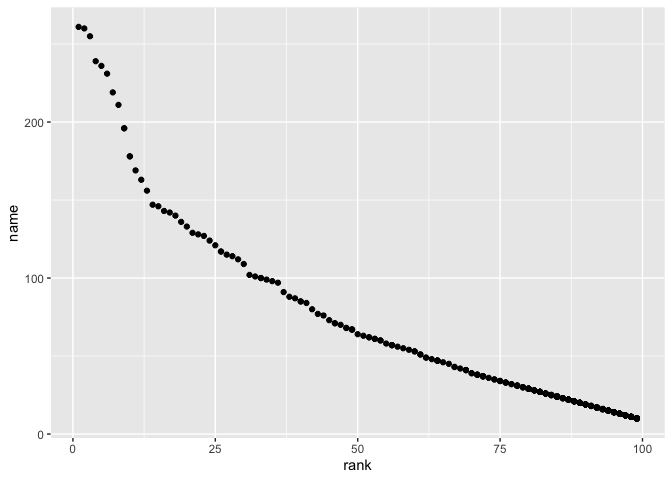

p8105\_hw2\_yz4187
================
Yiwen Zhao
10/9/2021

## Problem 1

*Read and clean the Mr. Trash Wheel sheet:*

``` r
trashwheel_data = read_excel("data/Trash-Wheel-Collection-Totals-7-2020-2.xlsx", sheet = "Mr. Trash Wheel", range = "A2:N535", ) %>%                                                 

janitor::clean_names() %>% 
drop_na(dumpster) %>% 
mutate(sports_balls = round(sports_balls, 0))

names(trashwheel_data)
```

    ##  [1] "dumpster"           "month"              "year"              
    ##  [4] "date"               "weight_tons"        "volume_cubic_yards"
    ##  [7] "plastic_bottles"    "polystyrene"        "cigarette_butts"   
    ## [10] "glass_bottles"      "grocery_bags"       "chip_bags"         
    ## [13] "sports_balls"       "homes_powered"

``` r
view(trashwheel_data)
```

*Read and clean precipitation data for 2018 and 2019. For each, omit
rows without precipitation data and add a variable for year. Next,
combine precipitation datasets and convert month to a character variable
(the variable month.name is built into R and should be useful)*

``` r
precipdata_2018 = read_excel("data/Trash-Wheel-Collection-Totals-7-2020-2.xlsx", sheet = "2018 Precipitation", range = "A2:B14") %>% 
janitor::clean_names() %>% 
mutate(year = "2018")

precipdata_2019 = read_excel("data/Trash-Wheel-Collection-Totals-7-2020-2.xlsx", sheet = "2019 Precipitation", range = "A2:B14") %>% 
janitor::clean_names() %>% 
mutate(year = "2019")

precipdata_combine = 
  bind_rows(precipdata_2018, precipdata_2019) %>%
  mutate(month = month.name[month]) %>% 
  select(year, month, total_inch = total)

view(precipdata_combine)

total = sum(select(filter(precipdata_combine, year == 2018), total_inch))
median = median(pull(filter(trashwheel_data, year == 2019 & sports_balls)))
```

*Write a paragraph about these data; you are encouraged to use inline R.
Be sure to note the number of observations in both resulting datasets,
and give examples of key variables. For available data, what was the
total precipitation in 2018? What was the median number of sports balls
in a dumpster in 2019?*

Comments about these data: In Mr.Trash Wheel dataset, the data describes
different types of trash of different dumpsters from 2014 to 2021. The
key variables is ‘dumpster’, which is the nrow(trashwheel\_data)‘. The
columes ’r ncol(trashwheel\_data)’ representes the weights, volumns, and
different types of trashes. The precipitation data set combines the
precipitation data in 2018 and 2019. ’r nrow(precipdata\_combine) shows
different months recorded, and the ’r ncol(precipdata\_combine)
represents years, months and total inch of precipitation. The total
precipitation in 2018 is total = sum(select(filter(precipdata\_combine,
year == 2018), total\_inch)) = 70.33. The median number of sports ball
in dumpster in 2019 is median = median(pull(filter(trashwheel\_data,
year == 2019 & sports\_balls))) = 50.67.

## Problem 2

*This problem uses the FiveThirtyEight data; these data were gathered to
create the interactive graphic on this page. In particular, we’ll use
the data in pols-month.csv, unemployment.csv, and snp.csv. Our goal is
to merge these into a single data frame using year and month as keys
across datasets.*

*First, clean the data in pols-month.csv*

``` r
pols_month = read_csv("fivethirtyeight_datasets/pols-month.csv") %>%
  janitor::clean_names() %>%
  separate(mon, c("year", "month", "day")) %>%
  mutate(month = month.abb[as.numeric(month)],
         president = ifelse(prez_gop == 1, "gop", "dem")) %>%
 select(-day, -prez_dem, -prez_gop)
```

    ## Rows: 822 Columns: 9

    ## ── Column specification ────────────────────────────────────────────────────────
    ## Delimiter: ","
    ## dbl  (8): prez_gop, gov_gop, sen_gop, rep_gop, prez_dem, gov_dem, sen_dem, r...
    ## date (1): mon

    ## 
    ## ℹ Use `spec()` to retrieve the full column specification for this data.
    ## ℹ Specify the column types or set `show_col_types = FALSE` to quiet this message.

*Second, clean the data in snp.csv using a similar process to the above*

``` r
snp_data = 
  read.csv(file = "fivethirtyeight_datasets/snp.csv") %>% 
  janitor::clean_names() %>% 
  separate(date, c("year", "month", "day")) %>% 
  mutate(month = month.abb[as.integer(month)]) %>% 
  select(year, month, close)
```

*Third, tidy the unemployment data so that it can be merged with the
previous datasets.*

``` r
unemployment_data = 
  read.csv(file = "fivethirtyeight_datasets/unemployment.csv") %>% 
  pivot_longer(
    Jan:Dec,
    names_to = "month",
    values_to = "rate"
  ) %>% 
  mutate(month = month.name[match(pull(., month), month.abb)],
         year = as.character(Year)) %>% 
  select(year, month, rate)
```

*Join the datasets by merging snp into pols, and merging unemployment
into the result.*

``` r
snp_pols_unemployment = 
  left_join(pols_month, snp_data,by = c("year", "month")) %>% 
  left_join(unemployment_data, by = c("year", "month"))
```

*Write a short paragraph about these datasets. Explain briefly what each
dataset contained, and describe the resulting dataset (e.g. give the
dimension, range of years, and names of key variables).*

‘pols\_month’ represents that whether the president is ‘dem’ or ‘gop’ in
different months and different years. ‘snp\_data’ represents the closing
values of snp in each year adn month. ‘unemployment\_data’ represents
that the unemployment rate in each moth and each year.
‘snp\_pols\_unemployment’ merge the three date frames into one table and
represents that the all the information of three tables together.

## Problem 3

``` r
baby_name = 
  read.csv(file = "Popular_Baby_Names.csv") %>%
  janitor::clean_names() %>% 
  mutate(
    gender = str_to_lower(gender),
    ethnicity = str_to_lower(ethnicity),
    child_s_first_name = str_to_lower(child_s_first_name)
    ) %>% 
  distinct()

view(baby_name)
```

‘Olivia’ and ‘Male’

``` r
olivia = 
  filter(baby_name, gender == "female", child_s_first_name == "olivia") %>% 
  select(year_of_birth, ethnicity, rank)

male= 
  filter(baby_name, gender == "male", rank == "1") %>% 
  select(child_s_first_name, year_of_birth, ethnicity, )
```

Scattorplot

``` r
scatter_plot = 
  filter( baby_name, 
          year_of_birth == "2016", 
          gender == "male", 
          ethnicity == "white non hispanic") %>% 
  select(rank, count)
ggplot(scatter_plot, aes(x = rank, y = count)) + geom_point() +labs( "Name popularity")
```

<!-- -->
